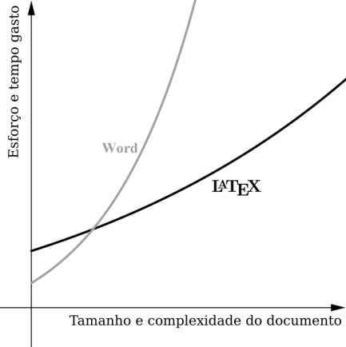
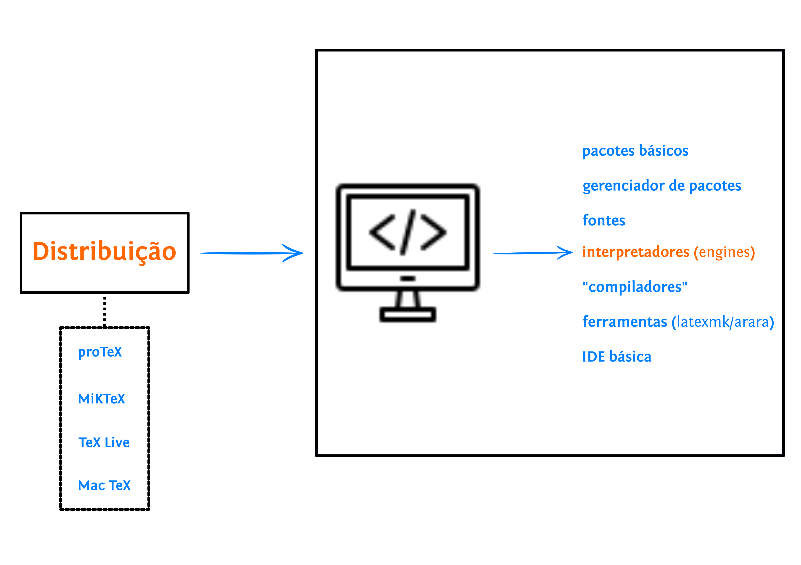
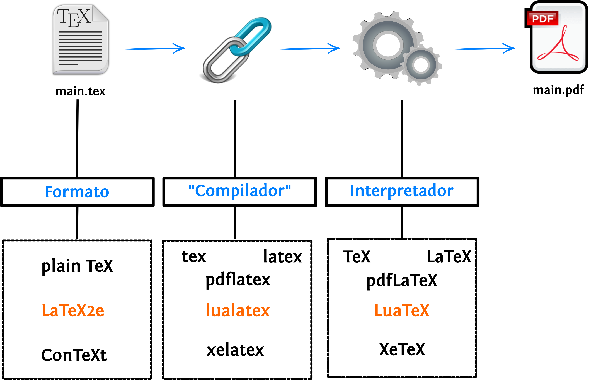
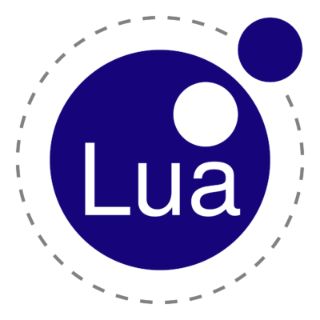
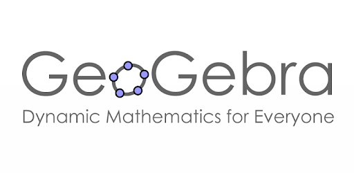
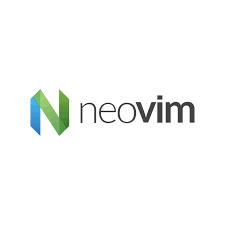

class: middle, center
background-image: url(img/jaiminho.jpeg)
background-size: cover

```{r setup, include=FALSE}
options(htmltools.dir.version = FALSE)
knitr::opts_chunk$set(
  fig.width=9, fig.height=3.5, fig.retina=3,
  out.width = "100%",
  cache = FALSE,
  echo = TRUE,
  message = FALSE, 
  warning = FALSE,
  hiline = TRUE
)
```

```{r xaringan-themer, include=FALSE, warning=FALSE}
library(xaringanthemer)
style_duo_accent(
  primary_color = "#1381B0",
  secondary_color = "#FF961C",
  inverse_header_color = "#FFFFFF"
)
xaringanExtra::use_tile_view()
xaringanExtra::use_scribble()
xaringanExtra::use_panelset()
xaringanExtra::use_clipboard() # para copiar códigos
xaringanExtra::use_extra_styles(
  hover_code_line = TRUE,         #<<
  mute_unhighlighted_code = TRUE  #<<
)
```

---
class: inverse center middle

# Antes de Começar ...

---
class: middle, left
background-image: url(img/pensando.gif)
background-position: right
background-size: contain

## Tipo de Formação </br> Profissional

--
- o que significa uma **formação superior**?

--
- o perigo da filosofia utilitarista </br> (quando extremada).

---
class: inverse center middle

# Como é fazer um TCC em Matemática?

---
class: middle, left
background-image: url(img/tema.gif)
background-position: right
background-size: contain

## A escolha do tema

--
- não é algo trivial

--
- considere suas aptidões 

--
- considere o tempo de execução 

--
- não é a [Medalha Fields](https://pt.wikipedia.org/wiki/Medalha_Fields)


---
class: middle, left
background-image: url(img/orientador.gif)
background-position: right
background-size: contain

## A escolha do </br> orientador

--
- analise características
  + organização
  + conhecimento
  + histórico

--
- saiba relacionar-se

--
- cumpra com suas obrigações

--
- não esconda nada

---
class: middle, left
background-image: url(img/tudoBem.gif)
background-position: right
background-size: contain

## Procedimentos para </br> estudos

--
- descobrindo algo novo?

--
- contribuindo com algo já existente?

--
- uso do quadro com o orientador

--
- rotina de estudos

--
- escreva semanalmente

--
- faça _backup_ de seus arquivos

---
class: middle, left
background-image: url(img/tcc.gif)
background-position: right
background-size: contain

## O bendito TCC

--
- Projeto _vs_ `tcc`
  + existem diferenças
  + vejam como uma preparação
  + aproveitem o que fizeram!

--
- Escolhendo a banca para o `tcc`

-- 
- Escrevendo o `tcc`
  + rotina é fundamental
  + estudar como uma prova
  + saia da **zona de conforto**!
  
---
class: middle, center
background-image: url(img/tcc-tempo.jpg)
background-size: contain

---
class: inverse center middle

# Ferramentas possivelmente úteis

---
## Linguagem de Marcação 

.panelset[
.panel[.panel-name[Markdown]

.pull-left[


- linguagem (muito) simples


- muito usada em textos online


- aprende-se em 10 minutos!


- simplifica o `html` em muitos aspectos

]

.pull-right[

[
```{r, echo=FALSE, fig.align='center'}
knitr::include_graphics("img/logo_markdown.png")
```
](https://dillinger.io/)


]

]

.panel[.panel-name[LaTeX]

.pull-left[

- $\LaTeX = \textrm{La} + \TeX{}$
- é uma linguagem
- não é **WYSIWYG**
- usa os melhores algorítmos tipográficos
- qualidade de impressão profissional
- ideal para textos "impressos"
  + [abnTeX2](http://www.abntex.net.br/)
  + [atvmatUFRB](https://github.com/icaro-freire/ativmatUFRB)
  + [jornais, revistas, etc.](https://ctan.org/topic/magazine)
  + [cifras, tablaturas ou partituras](https://ctan.org/pkg/latex4musicians)
  + [songbook](https://ctan.org/pkg/leadsheets)
  + [xadrez](https://ctan.org/pkg/texmate)
  + [sudoku](https://ctan.org/pkg/sudokubundle)
  + [labirintos](https://ctan.org/pkg/labyrinth)
  + [outros](https://ctan.org/topics/cloud)
- gratuito
]

.pull-right[

### Um pequeno exemplo
#### (Fórmula da Integral de Cauchy)

```{tex}
\[
  f(z) = \frac{1}{2 \pi i } 
  \oint_{\Gamma}\frac{f(z)}{z - z_0}
  \mathrm{d}z
\]
```

</br> 

$$f(z) = \frac{1}{2 \pi i } \oint_{\Gamma}\frac{f(z)}{z - z_0}\mathrm{d}z$$

]
 

]
]

---
### Tempo de aprendizagem no LaTeX

```{r, echo=FALSE, fig.align='center', out.width='50%'}

```

---
## Esquema de funcionamento do LaTeX

.panelset[

.panel[.panel-name[Instalando em minha máquina]

```{r, echo=FALSE, fig.align='center', out.width='65%'}

```


]

.panel[.panel-name[Ideia do Funcionamento]

```{r, echo=FALSE, fig.align='center', out.width='65%'}

```

]

.panel[.panel-name[Por onde começar]

.pull-left[
- Para conhecer e aprender
  + [CTAN --- Comprehensive TeX Archive Network](https://ctan.org/)
  + [TeX Users Group](https://tug.org/)
  + [LaTeX3](https://www.latex-project.org/)

- Para ajuda
  + [LaTeX BR (grupo Telegram)](https://t.me/LaTeXBR)
  + [tex.stackexchange](https://tex.stackexchange.com/)
]

.pull-right[

```{r, echo=FALSE, fig.align='center'}
knitr::include_graphics("img/latex-project-logo.svg")
```


]
]
]


---
## Linguagem de programação

.panelset[

.panel[.panel-name[R]

.pull-left[

- linguagem e ambiente de programação
- comunidade ativa e cordial
- Estável e flexível
- [Tidyverse](https://www.tidyverse.org/)
- Web Scraping
- Livro, sites, blogs --- [bookdown](https://bookdown.org/)
- site e blogs --- [distill](https://rstudio.github.io/distill/)

]

.pull-right[

```{r, echo=FALSE, fig.align='center', out.width='70%'}
knitr::include_graphics("img/Rlogo.png")
```


]

]

.panel[.panel-name[Python]

[
```{r, echo=FALSE, fig.align='center'}
knitr::include_graphics("img/python-logo.png")
```
](https://www.python.org/)

]

.panel[.panel-name[Lua]
[
```{r, echo=FALSE, fig.align='center', out.width='40%'}

```
](https://www.lua.org/)

]

]

---
## _Softwares_ amigos

.panelset[

.panel[.panel-name[Geogebra]

[
```{r, echo=FALSE, fig.align='center'}

```
](https://www.geogebra.org/?lang=pt)

]

.panel[.panel-name[Máxima]

[
```{r, echo=FALSE, fig.align='center', out.width='45%'}
knitr::include_graphics("img/logo_maxima.svg")
```
](https://maxima.sourceforge.io/)

]

.panel[.panel-name[Octave]

[
```{r, echo=FALSE, fig.align='center', out.width='70%'}
knitr::include_graphics("img/gnu-octave-logo-lnx.png")
```
](https://octave.org/index.html)

]

]

---
## Versionamento e hospedagem de arquivos

.panelset[

.panel[.panel-name[Git]

[
```{r, echo=FALSE, fig.align='center', out.width='80%'}
knitr::include_graphics("img/Git-Logo-1788C.png")
```
](https://git-scm.com/)

]

.panel[.panel-name[GitHub]

[
```{r, echo=FALSE, fig.align='center', out.width='40%'}
knitr::include_graphics("img/github-nome.png")
```
](https://github.com/)

]

]


---
## Editor de textos

.panelset[

.panel[.panel-name[Neovim]

[
```{r, echo=FALSE, fig.align='center', out.width='50%'}

```
](https://neovim.io/)

]

.panel[.panel-name[VSCode]

[
```{r, echo=FALSE, fig.align='center', out.width='40%'}
knitr::include_graphics("img/vscode.png")
```
](https://code.visualstudio.com/)

]

]


<!----------------------------------------------------------------------------->

---
class: inverse center middle

# Agradecimentos

---
class: center, middle

# Obrigado!

Esses slides foram criados com os seguintes pacotes em R:

[**xaringan**](https://github.com/yihui/xaringan)<br>
[**xaringanthemer**](https://github.com/gadenbuie/xaringanthemer) e
[**xaringanExtra**](https://pkg.garrickadenbuie.com/xaringanExtra/#/)

Também foi usado o [remark.js](https://remarkjs.com), [**knitr**](http://yihui.name/knitr), e [R Markdown](https://rmarkdown.rstudio.com), para escrita e "compilação".

</br>
</br>
</br>

